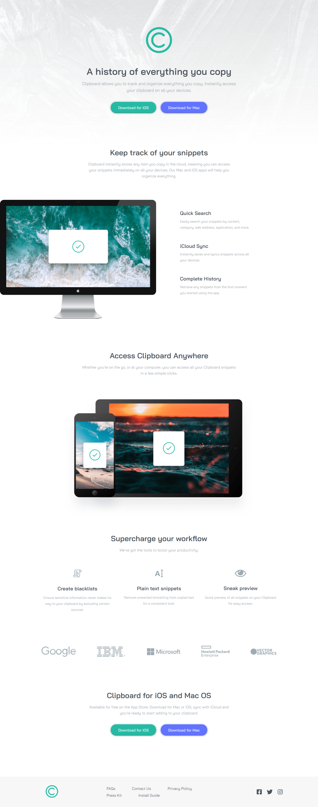

# Frontend Mentor - Clipboard landing page solution

This is a solution to the [Clipboard landing page challenge on Frontend Mentor](https://www.frontendmentor.io/challenges/clipboard-landing-page-5cc9bccd6c4c91111378ecb9). Frontend Mentor challenges help you improve your coding skills by building realistic projects. 

## Table of contents

- [Overview](#overview)
  - [The challenge](#the-challenge)
  - [Screenshot](#screenshot)
  - [Links](#links)
- [My process](#my-process)
  - [Built with](#built-with)
- [Author](#author)
- [Acknowledgments](#acknowledgments)

## Overview

### The challenge

Users should be able to:

- View the optimal layout for the site depending on their device's screen size
- See hover states for all interactive elements on the page

### Screenshots

### Links

- Solution URL: (https://www.frontendmentor.io/solutions/clipboard-landing-page-solution-html-and-css-0djggzD9_)
- Live Site URL: (https://lizanette.github.io/clipboard-landing-page/)

## My process

### Built with

- HTML5
- CSS
- CSS Grid

## Author

- Website - [Lizanette](https://lizanette.github.io/NewCV/)
- Frontend Mentor - [@lizanette](https://www.frontendmentor.io/profile/lizanette)

## Acknowledgments

Huge shoutout to all the YouTube community that gives free advice and help in all kinds of topics, especially in HTML and CSS grid.
